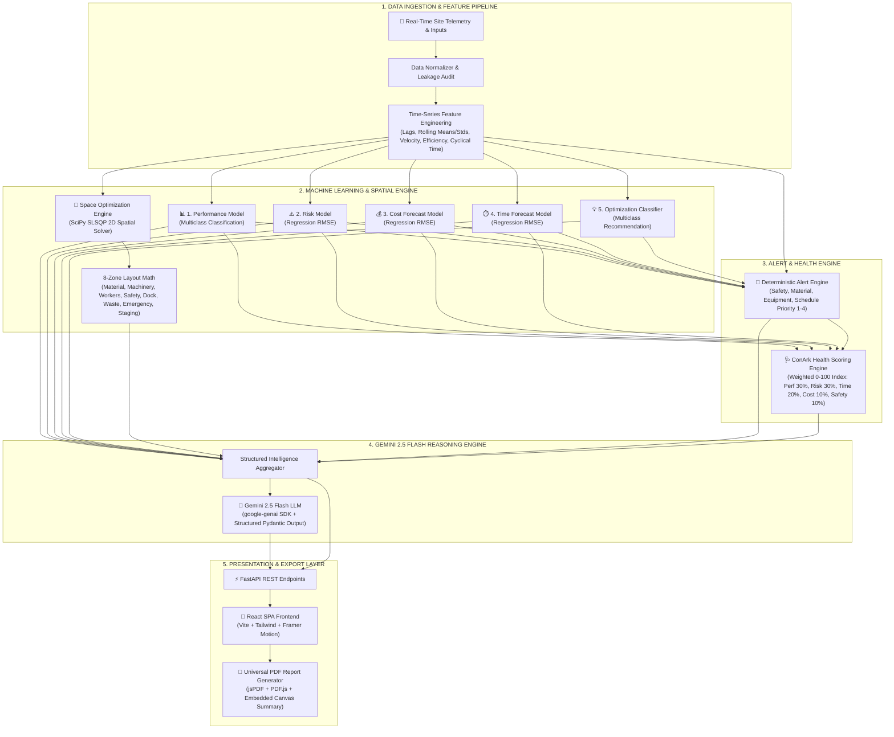

# 🏗️ ConArk Systems – Construction AI Intelligence Platform

<div align="center">

```
   ______ ____  _  _____    ____  __ __  _______  _______ ________  ________ 
  / ____// __ \/ |/ //   |  / __ \/ //_/ / ___/\ \/ / ___//_  __/ // / ___/
 / /    / /_/ /    // /| | / /_/ / ,<    \__ \  \  /\__ \  / / / // /\__ \ 
/ /___ / ____/ /|  // ___ |/ _, _/ /| |  ___/ /  / /___/ / / / /_/ /___/ / 
\____//_/   /_/ |_//_/  |_/_/ |_/_/ |_| /____/  /_//____/  /_/  \____/____/  
```

**Next-Generation AI Construction Intelligence, Predictive Analytics & Spatial Optimization Engine**

[](https://www.python.org/)
[](https://fastapi.tiangolo.com/)
[](https://react.dev/)
[](https://www.typescriptlang.org/)
[](https://vitejs.dev/)
[](https://deepmind.google/technologies/gemini/)
[](https://www.docker.com/)
[](https://conark-systems-2.onrender.com)
[](LICENSE)

---

### 🌐 Live Production Application
**[https://conark-systems-2.onrender.com](https://conark-systems-2.onrender.com)**

### 📖 Interactive REST API Documentation (Swagger UI)
**[https://conark-systems-2.onrender.com/docs](https://conark-systems-2.onrender.com/docs)**

---

> *"NUMBERS FROM MODELS. WORDS FROM GEMINI. DECISIONS BY HUMANS."*

</div>

---

## 📋 Table of Contents
1. [Executive Overview](#-executive-overview)
2. [Core System Architecture](#-core-system-architecture)
3. [Key Platform Features & AI Models](#-key-platform-features--ai-models)
   - [Model 01: Performance Prediction Model](#1-performance-prediction-model)
   - [Model 02: Risk Prediction Model](#2-risk-prediction-model)
   - [Model 03: Cost Forecasting Model](#3-cost-forecasting-model)
   - [Model 04: Time & Schedule Forecasting Model](#4-time--schedule-forecasting-model)
   - [Model 05: Recommendation & Space Optimization Engine](#5-recommendation--space-optimization-engine)
   - [Deterministic Alert Engine](#deterministic-alert-engine)
   - [ConArk Project Health Scoring Engine](#conark-project-health-scoring-engine)
   - [Gemini 2.5 Flash LLM Reasoning Layer](#gemini-2.5-flash-llm-reasoning-layer)
   - [Universal PDF Report Generation System](#universal-pdf-report-generation-system)
4. [Technology Stack](#-technology-stack)
5. [Repository Directory Structure](#-repository-directory-structure)
6. [Quick Start & Local Setup](#-quick-start--local-setup)
7. [Docker & Cloud Deployment](#-docker--cloud-deployment)
8. [REST API Documentation & Schemas](#-rest-api-documentation--schemas)
9. [The Brains Behind ConArk (Engineering Team)](#-the-brains-behind-conark)
10. [License & Acknowledgments](#-license--acknowledgments)

---

## 🔭 Executive Overview

**ConArk Systems** is an enterprise-grade AI-powered construction intelligence and spatial optimization platform. It bridges real-time IoT site monitoring telemetries (temperature, humidity, vibration levels, material usage rates, machinery status, worker density, energy consumption, task progress, safety incidents, and equipment utilization) with **5 pre-trained Machine Learning models**, a **SciPy SLSQP 2D Spatial Optimization Solver**, a **Deterministic Alert Engine**, a **Transparent Health Index**, and **Google Gemini 2.5 Flash LLM**.

### 💡 Core Engineering Philosophy
* **ML Predicts:** Trained supervised Machine Learning ensembles evaluate quantitative site risk, progress, budget deviations, and performance categories.
* **Optimization Decides:** SciPy Sequential Least Squares Programming (SLSQP) computes mathematically optimal 2D site layouts across 8 critical operational zones while enforcing strict safety buffer constraints.
* **Rules Detect:** Deterministic threshold engines evaluate safety hazard limits, material shortages, and machinery overloads.
* **Gemini Explains:** Gemini 2.5 Flash translates raw numeric matrices and alerts into structured executive reports with actionable mitigation strategies.
* **Humans Act:** Project managers and site engineers retain 100% final decision authority backed by transparent AI metrics.

---

## 🏗️ Core System Architecture



---

## ⚡ Key Platform Features & AI Models

### 1. Performance Prediction Model
* **Task:** Multiclass Classification (`Poor`, `Average`, `Good`, `Excellent`).
* **Target Variable:** `performance_category`
* **Evaluated Candidate Models:** RandomForestClassifier, ExtraTreesClassifier, GradientBoostingClassifier, HistGradientBoostingClassifier.
* **Evaluation Metric:** Macro F1 Score & Stratified K-Fold Cross-Validation.

### 2. Risk Prediction Model
* **Task:** Continuous Regression & Automated Risk Level Assignment.
* **Target Variable:** `risk_score` (0.0 to 100.0)
* **Risk Categories:**
  * `Low` ($0 \le S < 30$)
  * `Moderate` ($30 \le S < 60$)
  * `High` ($60 \le S < 85$)
  * `Critical` ($85 \le S \le 100$)
* **Evaluated Candidate Models:** RandomForestRegressor, ExtraTreesRegressor, GradientBoostingRegressor, Ridge Regression.
* **Evaluation Metric:** Root Mean Squared Error (RMSE) & $R^2$ Score.

### 3. Cost Forecasting Model
* **Task:** Continuous Regression & Budget Status Categorization.
* **Target Variable:** `cost_deviation` ($ USD)
* **Budget Categories:** `Under Budget` ($< -\$500$), `On Budget` ($[-\$500, +\$500]$), `Over Budget` ($> +\$500$).
* **Evaluated Candidate Models:** GradientBoostingRegressor, RandomForestRegressor, Ridge.
* **Evaluation Metric:** RMSE & MAE.

### 4. Time & Schedule Forecasting Model
* **Task:** Continuous Regression & Schedule Delay Assignment.
* **Target Variable:** `time_deviation` (Days)
* **Schedule Categories:** `Ahead` ($< -1.0\text{ day}$), `On Schedule` ($[-1.0, +1.0]\text{ day}$), `Delayed` ($> +1.0\text{ day}$).
* **Evaluated Candidate Models:** RandomForestRegressor, ExtraTreesRegressor, HistGradientBoostingRegressor.
* **Evaluation Metric:** RMSE & MAE.

### 5. Recommendation & Space Optimization Engine

#### 🔹 Part A: Machine Learning Optimization Classifier
* **Task:** Multiclass Classification (`optimization_suggestion`).
* **Categories:** `Increase Machinery Efficiency`, `Expand Workforce`, `Material Reallocation`, `Enhance Safety Protocols`, `Schedule Compression`, `Maintain Current Strategy`.
* **Determinism:** Extracts quantitative supporting factors driving the recommendation.

#### 🔹 Part B: SciPy SLSQP 2D Spatial Layout Optimization Solver
* **Mathematical Solver:** SciPy `scipy.optimize.minimize(method='SLSQP')`.
* **Objective Function:** Minimizes total site travel distance and material transport energy costs across 8 designated functional zones:
  1. `Material Storage Zone`
  2. `Heavy Equipment Zone`
  3. `Worker Hub / Welfare Station`
  4. `Safety & First Aid Post`
  5. `Loading & Unloading Dock`
  6. `Waste Management Area`
  7. `Emergency Access Route`
  8. `Pre-Assembly & Staging Area`
* **Constraint Satisfaction:** Enforces hard boundary limits ($L \times W$), non-overlapping zone geometry, and safety buffer distances (e.g. Heavy Equipment to Worker Hub $\ge 8.0\text{ m}$).

---

### 🚨 Deterministic Alert Engine
Evaluates real-time sensor metrics against calibrated civil engineering threshold rules:
* **Safety Incidents:** $\ge 1$ triggers `CRITICAL` safety alerts.
* **Equipment Vibration:** $> 25.0\text{ mm/s}$ combined with High Utilization triggers `HIGH` machinery failure warnings.
* **Material Shortage:** `material_shortage_alert == 1` triggers `HIGH` inventory replenishment alerts.
* **Schedule Delays:** Predicted time deviation $> 3.0\text{ days}$ triggers `MEDIUM` timeline alerts.
* **Priority Sorting:** Sorts alerts from Priority 1 (Critical) to Priority 4 (Low) for immediate operational triage.

---

### 🩺 ConArk Project Health Scoring Engine
Calculates a unified, transparent 0–100 Project Health Index ($H$) using weighted multi-objective scoring:

$$H = 0.30 \cdot S_{\text{Perf}} + 0.30 \cdot S_{\text{Risk}} + 0.20 \cdot S_{\text{Time}} + 0.10 \cdot S_{\text{Cost}} + 0.10 \cdot S_{\text{Safety}}$$

Where:
* $S_{\text{Perf}}$ = Performance score normalized to $[0, 100]$.
* $S_{\text{Risk}} = 100 - \text{Risk Score}$.
* $S_{\text{Time}}$ = Normalized schedule compliance index.
* $S_{\text{Cost}}$ = Normalized budget compliance index.
* $S_{\text{Safety}} = \max(0, 100 - 25 \times \text{Safety Incidents})$.

**Health Status Classifications:**
* `Excellent` ($85 \le H \le 100$)
* `Good` ($70 \le H < 85$)
* `Needs Attention` ($50 \le H < 70$)
* `Critical` ($0 \le H < 50$)

---

### 🤖 Gemini 2.5 Flash LLM Reasoning Layer
Integrated via the official `google-genai` SDK using domain-specific API keys loaded securely from `.env`:
* **Structured Output Guarantee:** Enforces `GeminiConstructionReport` Pydantic schema using `response_mime_type="application/json"`.
* **Domain Key Isolation:**
  * `PERFORMANCE` & `RISK`: `GEMINI_API_KEY_PERFORMANCE`, `GEMINI_API_KEY_RISK`
  * `COST` & `TIME`: `GEMINI_API_KEY_COST`, `GEMINI_API_KEY_TIME`
  * `RECOMMENDATION & SPACE OPTIMIZATION`: `GEMINI_API_KEY_OPTIMIZATION`
* **Non-Overriding Safety Boundary:** Gemini contextualizes alerts, synthesizes executive summaries, and formulates actionable recommendations. It **never** alters or recalculates numeric ML predictions.
* **Graceful Fallback:** If API keys are absent or external quota limits are reached, the platform seamlessly returns complete deterministic ML results and alerts without breaking execution.

---

### 📄 Universal PDF Report Generation System
Generates client-side PDF inspection reports from any ML execution result:
* **Branded Layout:** Includes ConArk headers, Pink Diamond watermark, report metadata, and execution timestamp.
* **Complete Audit Trail:** Renders input telemetries, model predictions, confidence intervals, risk indicators, SciPy spatial layout summaries, and Gemini actionable advice.
* **PDF.js Interactive Viewer:** Embedded in-app previewer with direct download capabilities.

---

## 🛠️ Technology Stack

| Layer | Technologies & Frameworks |
|-------|---------------------------|
| **Backend Framework** | Python 3.11+, FastAPI, Uvicorn, Pydantic v2, Pydantic-Settings |
| **Machine Learning & Optimization** | Scikit-Learn, LightGBM, XGBoost, SciPy (`optimize.minimize`), NumPy, Pandas |
| **Generative AI / LLM** | Google Gemini 2.5 Flash (`google-genai` SDK) |
| **Frontend SPA** | React 18, TypeScript, Vite 5, Tailwind CSS, Framer Motion, Lucide Icons |
| **PDF Generation** | jsPDF, HTML2Canvas, PDF.js |
| **Testing & Quality** | Pytest, Pytest-Asyncio, HTTPX, Coverage |
| **Containerization & Deployment** | Docker, Docker Compose, Render Native Python Environment |

---

## 📂 Repository Directory Structure

```
ConArk Systems/
├── .env.example                  # Environment variable configuration template
├── Dockerfile                    # Production Docker container manifest
├── docker-compose.yml            # Multi-container orchestration config
├── render.yaml                   # Render Cloud deployment manifest
├── build_render.sh               # Native Render build automation script
├── requirements.txt              # Production Python dependencies
├── PRD.md                        # Product Requirements Document
├── TRD.md                        # Technical Requirements Document
├── RENDER_DEPLOYMENT.md          # Cloud Deployment Manual
│
├── src/                          # Core Python Backend Package
│   └── conark/
│       ├── api/                  # FastAPI Application Routes & Endpoints
│       │   ├── main.py           # FastAPI entrypoint & static SPA mounter
│       │   ├── dependencies.py   # Dependency injection container
│       │   └── routes/           # REST Router modules (health, analyze, optimize)
│       ├── config/               # App settings & environment loaders
│       ├── features/             # Time-series feature engineering pipeline
│       ├── gemini/               # Gemini 2.5 Flash SDK client & prompt engine
│       ├── models/               # ML Model artifacts & inference wrappers
│       ├── space/                # SciPy SLSQP 2D Spatial Optimization Engine
│       ├── training/             # Automated model training & candidate selection
│       └── utils/                # Logging & utility helpers
│
├── frontend/                     # React 18 + Vite 5 SPA Package
│   ├── public/                   # Static assets & vector SVG favicon
│   ├── src/
│   │   ├── components/           # UI Components (Nav, Cards, Modals, PDF Viewers)
│   │   ├── pages/                # Application Page Views (Dashboard, Models, Brains)
│   │   ├── services/             # Axios API client & PDF generation engines
│   │   ├── types/                # TypeScript interfaces & API schemas
│   │   └── App.tsx               # Main SPA router & Scroll-to-Top controller
│   ├── package.json              # Node.js dependencies
│   └── vite.config.ts            # Vite build configuration
│
├── data/                         # Datasets & synthetic data generators
├── models/                       # Trained Scikit-Learn `.pkl` model artifacts
├── reports/                      # Data quality & model benchmark reports
└── tests/                        # Pytest suite (API, ML pipelines, Gemini fallbacks)
```

---

## 🚀 Quick Start & Local Setup

### Prerequisites
* **Python:** `3.11` or higher
* **Node.js:** `18.0.0` or higher (`npm v9+`)
* **Git**

---

### Step 1: Clone Repository & Virtual Environment Setup

```bash
# Clone the repository
git clone https://github.com/shubham392007-sketch/ConArk_Systems.git
cd ConArk_Systems

# Create and activate Python virtual environment
# Windows (PowerShell):
python -m venv venv
.\venv\Scripts\Activate.ps1

# Linux / macOS:
python3 -m venv venv
source venv/bin/activate

# Install Python backend dependencies
pip install --upgrade pip
pip install -r requirements.txt
```

---

### Step 2: Configure Environment Variables

Copy `.env.example` to create `.env`:

```bash
cp .env.example .env
```

Update your `.env` file with your Gemini API keys:

```env
APP_NAME="ConArk Systems"
APP_ENV="development"
PORT=8000

# Domain-Specific Gemini API Keys
GEMINI_API_KEY_PERFORMANCE="your_gemini_api_key_here"
GEMINI_API_KEY_RISK="your_gemini_api_key_here"
GEMINI_API_KEY_COST="your_gemini_api_key_here"
GEMINI_API_KEY_TIME="your_gemini_api_key_here"
GEMINI_API_KEY_OPTIMIZATION="your_gemini_api_key_here"
GEMINI_MODEL="gemini-2.5-flash"
```

---

### Step 3: Run Master Training Pipeline (Optional)

Train all 5 ML models, engineer features, evaluate candidates, and export `.pkl` artifacts:

```powershell
# Windows (PowerShell):
$env:PYTHONPATH="src"
python -m conark.training.train_all

# Linux / macOS:
PYTHONPATH=src python3 -m conark/training/train_all.py
```

---

### Step 4: Run Pytest Test Suite

Execute automated unit, integration, and API tests:

```powershell
# Windows (PowerShell):
$env:PYTHONPATH="src"
pytest -v

# Linux / macOS:
PYTHONPATH=src pytest -v
```

---

### Step 5: Start Local Development Servers

#### 1. Start FastAPI Backend Server:
```powershell
# Windows (PowerShell):
$env:PYTHONPATH="src"
python -m uvicorn conark.api.main:app --host 0.0.0.0 --port 8000 --reload
```
* Backend API base URL: `http://localhost:8000`
* Interactive API Documentation (Swagger UI): `http://localhost:8000/docs`

#### 2. Start React Vite Frontend Server (in a second terminal):
```bash
cd frontend
npm install
npm run dev
```
* Local Web App URL: `http://localhost:5173`

---

## 🐳 Docker & Cloud Deployment

### Run Locally with Docker Compose

Build and launch both FastAPI backend and static SPA frontend inside Docker:

```bash
docker compose up --build
```
Access the application at `http://localhost:8000`.

---

### Cloud Deployment (Render)

ConArk Systems is pre-configured for automated deployment on **Render**:
1. Connect your GitHub repository to Render.
2. Select **Web Service** with **Python** environment.
3. Set Build Command: `./build_render.sh`
4. Set Start Command: `PYTHONPATH=src uvicorn conark.api.main:app --host 0.0.0.0 --port $PORT`
5. Add your `GEMINI_API_KEY_*` secrets under Render Environment Variables.

---

## 📡 REST API Documentation & Schemas

### Endpoints Overview

| Method | Endpoint | Description |
|--------|----------|-------------|
| `GET` | `/api/v1/health` | Service health status & loaded model availability |
| `POST` | `/api/v1/intelligence/analyze` | Core Analysis Endpoint (Runs 5 ML Models + Alerts + Health + Gemini) |
| `POST` | `/api/v1/space-optimization/optimize` | SciPy SLSQP 2D Site Spatial Layout Optimization Endpoint |
| `POST` | `/api/v1/prediction/performance` | Isolated Model 01 Performance Prediction |
| `POST` | `/api/v1/prediction/risk` | Isolated Model 02 Risk Prediction |
| `POST` | `/api/v1/prediction/cost` | Isolated Model 03 Cost Forecast |
| `POST` | `/api/v1/prediction/time` | Isolated Model 04 Time Forecast |
| `POST` | `/api/v1/prediction/recommendation` | Isolated Model 05 Optimization Classification |

---

### Sample Request: `POST /api/v1/intelligence/analyze`

```json
{
  "timestamp": "2026-08-18T10:00:00",
  "temperature": 32.5,
  "humidity": 62.0,
  "vibration_level": 28.6,
  "material_usage": 6800.0,
  "machinery_status": 1,
  "worker_count": 74,
  "energy_consumption": 920.0,
  "task_progress": 0.52,
  "safety_incidents": 2,
  "equipment_utilization_rate": 89.0,
  "material_shortage_alert": 1
}
```

---

### Sample Response Output

```json
{
  "request_id": "c4efb080-4c6b-45d8-b4bb-02ba29fb41b1",
  "system": "ConArk Systems",
  "timestamp": "2026-08-18T10:00:00",
  "ml_results": {
    "performance": {
      "prediction": "Good",
      "confidence": 0.91,
      "probabilities": { "Poor": 0.01, "Average": 0.08, "Good": 0.91, "Excellent": 0.00 }
    },
    "risk": {
      "risk_score": 67.4,
      "risk_level": "High",
      "estimated_range": { "lower": 58.2, "upper": 76.6 }
    },
    "cost_forecast": {
      "predicted_cost_deviation": 2450.80,
      "budget_status": "Over Budget"
    },
    "time_forecast": {
      "predicted_time_deviation_days": 4.2,
      "schedule_status": "Delayed"
    },
    "optimization": {
      "recommendation": "Increase Machinery Efficiency",
      "confidence": 0.87,
      "supporting_factors": [
        "High equipment utilization rate (89.0%)",
        "Elevated machinery vibration level (28.6 mm/s)"
      ]
    }
  },
  "alerts": [
    {
      "type": "SAFETY",
      "severity": "CRITICAL",
      "title": "Active Safety Incidents Alert",
      "message": "2 safety incidents recorded during current operational window.",
      "source": "rule_engine",
      "priority": 1
    },
    {
      "type": "EQUIPMENT",
      "severity": "HIGH",
      "title": "Equipment Overload Warning",
      "message": "Equipment utilization (89.0%) and vibration (28.6 mm/s) exceed nominal thresholds.",
      "source": "rule_engine",
      "priority": 2
    }
  ],
  "health": {
    "overall_health_score": 62,
    "health_status": "Needs Attention"
  },
  "gemini_report": {
    "status": "success",
    "message": "Generated via Gemini 2.5 Flash",
    "report": {
      "overall_status": "Needs Immediate Attention",
      "executive_summary": "Project performance remains good at 91% confidence, but 2 recorded safety incidents and high equipment vibration require immediate site inspection.",
      "recommended_actions": [
        "Halt high-vibration machinery for structural inspection",
        "Enforce safety protocol review with ground personnel",
        "Reallocate material reserve to address shortage alert"
      ],
      "priority": "High"
    }
  },
  "system_status": "success"
}
```

---

## 👥 The Brains Behind ConArk

ConArk Systems is built collaboratively by a multidisciplinary engineering team bridging Artificial Intelligence, Machine Learning, Data Architecture, Research, and Public Relations.

<br/>

<div align="center">

| Founder & Engineering Specialist | Role & Discipline | Contact & Official Social Accounts |
|:---------------------------------|:------------------|:-----------------------------------|
| **Siddhesh Birewar** | **Research Engineer & PR Specialist** | ✉️ [Email](mailto:siddhesh.birewar25@pccoepune.org) • 💼 [LinkedIn](https://www.linkedin.com/in/siddhesh-birewar-20bb3136b/)<br>🐙 [GitHub](https://github.com/Siddhesh-Birewar) • 📸 [Instagram](https://www.instagram.com/s_i_d_d_h_e_s_h_1o1/?hl=en) |
| **Vernit Garg** | **Research Specialist & Machine Learning Engineer** | ✉️ [Email](mailto:vernit.gerg25@pccoepune.org) • 💼 [LinkedIn](https://www.linkedin.com/in/vernit-garg-231539385/)<br>🐙 [GitHub](https://github.com/Vernit185) • 📸 [Instagram](https://www.instagram.com/qubec_185/?hl=en) |
| **Shubham Pokale** | **Artificial Intelligence Engineer & Technical Support Specialist** | ✉️ [Email](mailto:shubham.pokale25@pccopepune.org) • 💼 [LinkedIn](https://www.linkedin.com/in/shubham-pokale-94030b37a/)<br>🐙 [GitHub](https://github.com/shubham392007-sketch) • 📸 [Instagram](https://www.instagram.com/shubhamofficial_2007/?hl=en) |
| **Ram Khabale** | **Data Analyst & Data Architect** | ✉️ [Email](mailto:ram.khabale25@pccoepune.org) • 💼 [LinkedIn](https://www.linkedin.com/in/ram-khabale-b7b1a23b0/)<br>🐙 [GitHub](https://github.com/Ram19RK) • 📸 [Instagram](https://www.instagram.com/ramkhabale1819/?hl=en) |

</div>

<br/>

> *"Four minds. Different disciplines. One construction intelligence system."*

---

## 📜 License & Acknowledgments

* **License:** Distributed under the **MIT License**. See `LICENSE` for details.
* **AI Models & Frameworks:** Built using Scikit-Learn, LightGBM, XGBoost, SciPy, FastAPI, and Google Gemini 2.5 Flash.
* **Institutional Affiliation:** Developed at PCCOE Pune.

<div align="center">

**[ConArk Systems Live Platform](https://conark-systems-2.onrender.com)** • **[API Documentation](https://conark-systems-2.onrender.com/docs)** • **[GitHub Repository](https://github.com/shubham392007-sketch/ConArk_Systems)**

*© 2026 ConArk Systems. All Rights Reserved.*

</div>
