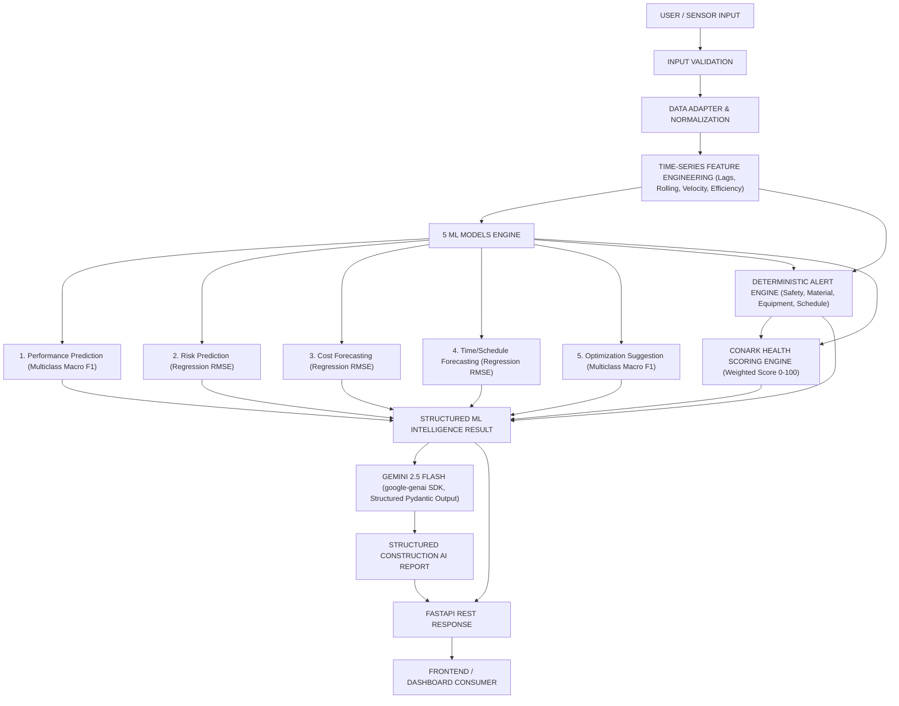

# ConArk Systems – Construction AI Intelligence Platform

ConArk Systems is a production-oriented AI construction intelligence platform that processes real-time site monitoring data and produces five core ML outputs, deterministic operational alerts, a project health score, and structured AI explanations powered by Gemini 2.5 Flash over a FastAPI REST interface.

---

## Architecture Diagram



---

## Key Features

1. **5 Core Machine Learning Models:**
   - **Performance Prediction:** Multiclass classification (`Poor`, `Average`, `Good`, `Excellent`).
   - **Risk Prediction:** Regression for `risk_score` (0–100) and risk level assignment (`Low`, `Moderate`, `High`, `Critical`).
   - **Cost Forecasting:** Regression for `cost_deviation` in dollars and budget status (`Under Budget`, `On Budget`, `Over Budget`).
   - **Time/Schedule Forecasting:** Regression for `time_deviation` in days and schedule status (`Ahead`, `On Schedule`, `Delayed`).
   - **Optimization Recommendation:** Multiclass classification (`optimization_suggestion`) with deterministic supporting factor extraction.

2. **Deterministic Alert & Decision Engine:**
   - Evaluates rule-based thresholds across Safety, Material, Equipment, Schedule, and Risk.
   - Assigns priorities (1 = Critical, 2 = High, 3 = Medium, 4 = Low) and sorts alerts for actionability.

3. **Transparent Project Health Scoring:**
   - Weighted scoring formula: Performance (30%), Risk (30%), Schedule (20%), Cost (10%), Safety (10%).
   - Normalizes all components to a 0–100 unified index.

4. **Gemini 2.5 Flash Structured Explanation Layer:**
   - Official `google-genai` SDK integration with Pydantic `GeminiConstructionReport` structured JSON schema.
   - Enforces strict role boundary: Gemini explains predictions, contextualizes alerts, and formats reports; it never recalculates or overrides ML numerical predictions.
   - Robust fallback handling: system operates seamlessly even if `GEMINI_API_KEY` is missing or API calls fail.

5. **Dataset Adapter & Leakage Audit:**
   - Supports primary schema and legacy/secondary schemas through `DatasetNormalizer`.
   - Performs target leakage analysis and documents formulaic synthetic data relationships in `reports/data_quality_report.md`.

---

## Quick Start & Local Setup

### 1. Environment Setup
```powershell
python -m venv venv
.\venv\Scripts\Activate.ps1
pip install -r requirements.txt
```

### 2. Configure Environment Variables
Copy `.env.example` to `.env` and set your API key:
```env
GEMINI_API_KEY=your_gemini_api_key_here
GEMINI_MODEL=gemini-2.5-flash
```

### 3. Run Master Training Pipeline
Train all 5 ML models, generate features, evaluate candidates, and export models:
```powershell
$env:PYTHONPATH="src"
python -m conark.training.train_all
```

### 4. Run Pytest Test Suite
```powershell
$env:PYTHONPATH="src"
pytest -v
```

### 5. Start FastAPI Application
```powershell
$env:PYTHONPATH="src"
uvicorn conark.api.main:app --host 0.0.0.0 --port 8000 --reload
```
Interactive Swagger UI documentation: [http://localhost:8000/docs](http://localhost:8000/docs)

---

## Docker Support

Build and run using Docker Compose:
```powershell
docker compose up --build
```

---

## API Documentation & Example Request

### `POST /api/v1/intelligence/analyze`

**Request Payload:**
```json
{
  "timestamp": "2023-01-01T00:08:00",
  "temperature": 30.03,
  "humidity": 42.41,
  "vibration_level": 17.03,
  "material_usage": 551.89,
  "machinery_status": 1,
  "worker_count": 48,
  "energy_consumption": 153.69,
  "task_progress": 0.3679,
  "safety_incidents": 0,
  "equipment_utilization_rate": 87.2,
  "material_shortage_alert": 0
}
```

**Response Payload:**
```json
{
  "request_id": "a6b8c9d0-1234-5678-9abc-def012345678",
  "system": "ConArk Systems",
  "timestamp": "2023-01-01T00:08:00",
  "ml_results": {
    "performance": {
      "prediction": "Good",
      "confidence": 0.91,
      "probabilities": { "Poor": 0.01, "Average": 0.08, "Good": 0.91, "Excellent": 0.00 }
    },
    "risk": {
      "risk_score": 67.4,
      "risk_level": "High",
      "estimated_range": { "lower": 58.2, "upper": 76.6 }
    },
    "cost_forecast": {
      "predicted_cost_deviation": 2450.8,
      "budget_status": "Over Budget"
    },
    "time_forecast": {
      "predicted_time_deviation_days": 4.2,
      "schedule_status": "Delayed"
    },
    "optimization": {
      "recommendation": "Increase Machinery Efficiency",
      "confidence": 0.87,
      "supporting_factors": [
        "High equipment utilization rate",
        "Elevated machinery vibration level"
      ]
    }
  },
  "alerts": [
    {
      "type": "EQUIPMENT",
      "severity": "HIGH",
      "title": "Equipment Overload Warning",
      "message": "Equipment utilization (87.2%) and vibration (17.0 mm/s) are both near maximum operational thresholds.",
      "source": "rule_engine",
      "priority": 2
    }
  ],
  "health": {
    "overall_health_score": 74,
    "health_status": "Good"
  },
  "gemini_report": {
    "status": "success",
    "message": "Generated via Gemini 2.5 Flash",
    "report": {
      "overall_status": "Needs Attention",
      "executive_summary": "Project performance is currently good, but elevated machinery vibration and equipment utilization are increasing operational risk.",
      "key_findings": [
        "Performance remains within Good range",
        "Risk is elevated due to machinery conditions",
        "Equipment utilization is high"
      ],
      "critical_alerts": [
        "EQUIPMENT: Equipment Overload Warning"
      ],
      "risk_explanation": "Predicted risk score is 67.4 (High) driven by high equipment utilization and vibration.",
      "performance_explanation": "Performance model evaluated site state as Good with 91% confidence.",
      "cost_explanation": "Cost deviation is forecasted at +$2,450.80 over budget.",
      "schedule_explanation": "Project timeline is lagging by 4.2 days.",
      "optimization_explanation": "Machinery efficiency optimization is recommended based on utilization rate.",
      "recommended_actions": [
        "Inspect high-vibration machinery",
        "Review equipment utilization schedule"
      ],
      "priority": "High",
      "confidence_note": "Grounded in deterministic ML predictions."
    }
  },
  "system_status": "success"
}
```
